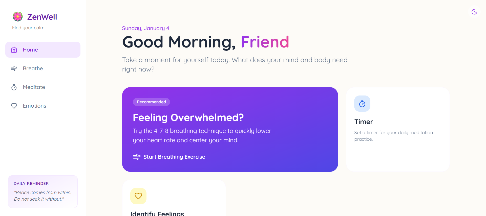
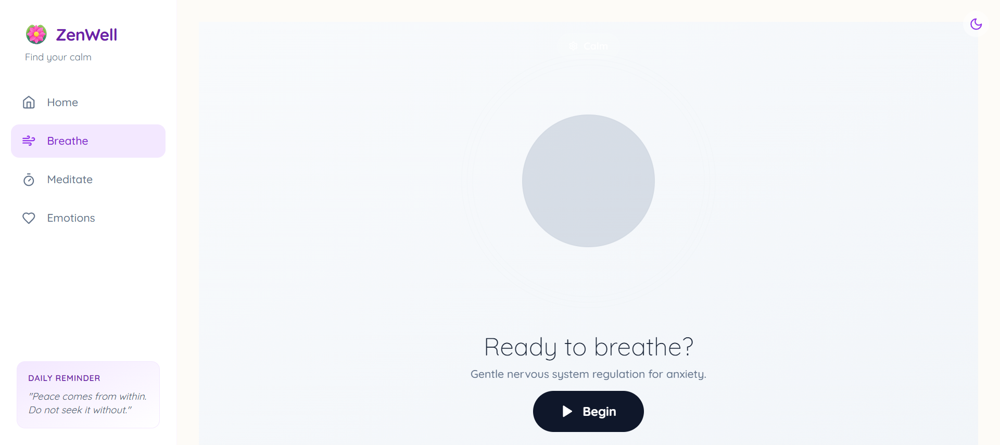
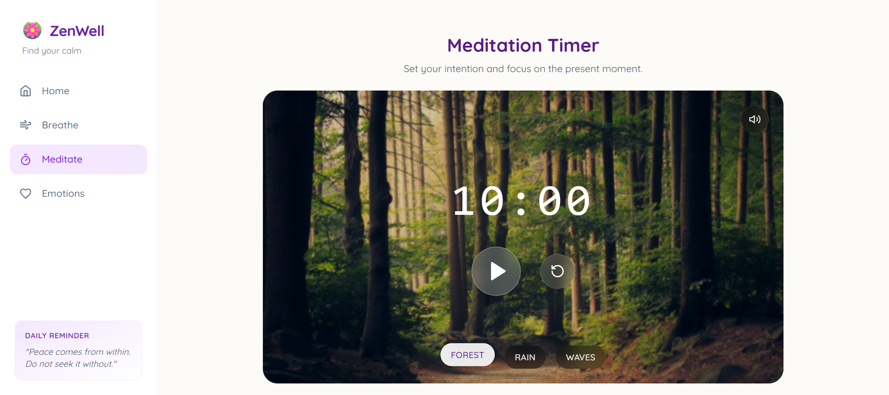
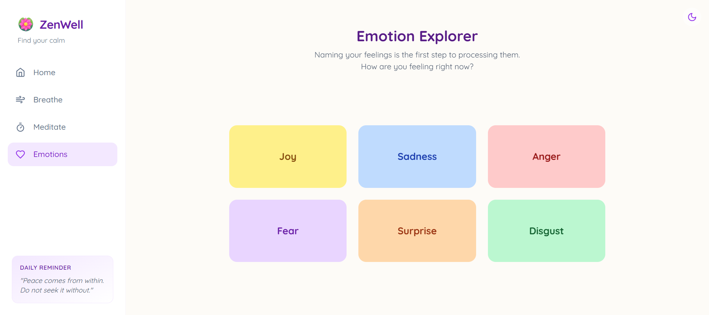

# Lavender Zen Wellness

A comprehensive wellness application designed to help you relax, focus, and manage your emotions through guided breathing, meditation, and emotional awareness tools.

<div align="center">

</div>

## Features

### Breathing Exercises

Customizable breathing patterns with atmospheric visualizations to help you center yourself.

- **Relax (4-7-8)**: Classic technique for sleep and anxiety.
- **Calm (4-4-7)**: Gentle nervous system regulation.
- **Box (4-4-4)**: Focus and stress relief.
- **Balance (5-5-5)**: Equalizing breath for focus.
- **Custom**: Define your own rhythm.

<div align="center">

</div>

### Meditation Timer

Simple, elegant timer with ambient soundscapes to support your practice.

<div align="center">

</div>

### Emotion Selector

A tool to help identify and articulate your feelings, fostering emotional intelligence.

<div align="center">

</div>

## Run Locally

**Prerequisites:** Node.js

1. Install dependencies:
   ```bash
   npm install
   ```
2. Run the app:
   ```bash
   npm run dev
   ```
